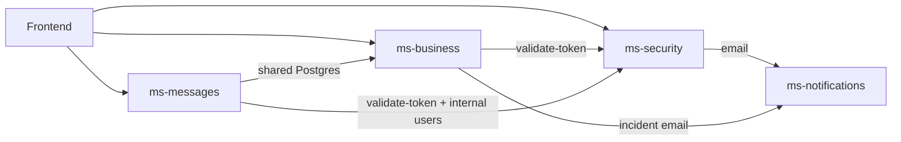

# Monorepo dev-backend-uc

## Estructura

```
dev-backend-uc/
├── ms-security/       # Auth, JWT, OAuth, roles (Java/Spring)
├── ms-business/       # Dominio transporte (NestJS, PostgreSQL)
├── ms-messages/       # Mensajería + Socket.IO (NestJS; misma BD que business)
├── ms-notifications/  # Email Gmail API (FastAPI, Python)
├── docs/              # ROLES, DEPLOY, login frontend
├── docker-compose.yml
└── .agents/skills/    # Skills por microservicio
```

## Puertos, health y documentación API

| Servicio | Puerto | Health | Swagger / docs |
|----------|--------|--------|----------------|
| ms-security | 8080 | `/actuator/health` | `/swagger-ui/index.html` |
| ms-business | 3000 | — | `/docs` |
| ms-messages | 3001 | `/health` | `/docs` |
| ms-notifications | 8000 | `/api/email/health` | `/docs` |

Probar Swagger con JWT (Nest): skill `ms-business` → [swagger-testing.md](../ms-business/references/swagger-testing.md).  
Flujo login → token → **Authorize** en `/docs` requiere ms-security arriba.

## Dependencias entre servicios



## Verificación local (agentes) vs CI

Scripts pensados para feedback rápido antes de commit. **CI en GitHub sigue siendo más estricto.**

| Microservicio | Script rápido | Qué hace | CI adicional |
|---------------|---------------|----------|--------------|
| ms-security | `ms-security/scripts/build.sh` | `mvn package -DskipTests` | `./mvnw verify` |
| ms-business | `ms-business/scripts/verify.sh` | `lint` + `build` | `pnpm test` |
| ms-messages | `ms-messages/scripts/verify.sh` | `lint` + `build` | `pnpm test` |
| ms-notifications | `ms-notifications/scripts/lint.sh` | ruff check + format | — |

Desde la raíz del repo:

```bash
./.agents/skills/ms-security/scripts/build.sh
./.agents/skills/ms-business/scripts/verify.sh
./.agents/skills/ms-messages/scripts/verify.sh
./.agents/skills/ms-notifications/scripts/lint.sh
```

## Checklist antes de codificar

1. ¿Qué microservicio toca el cambio? → abrir su `SKILL.md`.
2. ¿Afecta autenticación? → `ms-security` + `docs/ROLES.md`.
3. ¿Afecta emails? → `ms-notifications` + `MS_NOTIFICATION_URL`.
4. ¿Afecta mensajería / WebSocket? → `ms-messages` (misma BD que business).
5. ¿Cambia contrato HTTP entre MS? → `references/inter-service-contracts.md`.
6. ¿Necesitas probar rutas protegidas en Nest? → ms-security + JWT en Swagger `/docs`.
7. ¿Necesitas varios MS arriba? → `references/local-dev.md`.

## Skills por carpeta

| Si editas… | Skill | Arquitectura / Swagger |
|------------|-------|-------------------------|
| `ms-business/**` | `ms-business` | `references/architecture.md`, `references/swagger-testing.md` |
| `ms-messages/**` | `ms-messages` | `ms-messages/README.md` |
| `ms-security/**` | `ms-security` | `references/architecture.md`, `references/swagger-testing.md` |
| `ms-notifications/**` | `ms-notifications` | `references/architecture.md`, `references/swagger-testing.md` |
| Raíz, `docs/`, `docker-compose.yml` | Esta skill + MS afectado | — |

## Referencias

- Contratos HTTP: [references/inter-service-contracts.md](references/inter-service-contracts.md)
- Desarrollo local: [references/local-dev.md](references/local-dev.md)
- Índice agentes: [AGENTS.md](../../../AGENTS.md)
