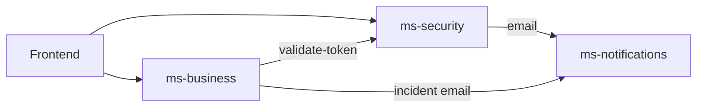

# Monorepo dev-backend-uc

## Estructura

```
dev-backend-uc/
├── ms-security/       # Auth, JWT, OAuth, roles (Java/Spring, MongoDB)
├── ms-business/       # Dominio transporte (NestJS, PostgreSQL)
├── ms-notifications/  # Email Gmail API (FastAPI, Python)
├── docs/              # ROLES, DEPLOY, login frontend
├── docker-compose.yml
└── .agents/skills/    # Skills por microservicio
```

## Puertos y URLs locales

| Servicio | Puerto | Health / docs |
|----------|--------|----------------|
| ms-security | 8080 | `http://localhost:8080/actuator/health` |
| ms-business | 3000 | Swagger `http://localhost:3000/docs` |
| ms-notifications | 8000 | `GET /api/email/health`, Swagger `/docs` |

## Dependencias entre servicios



## Checklist antes de codificar

1. ¿Qué microservicio toca el cambio?
2. ¿Afecta autenticación? → revisar skill `ms-security` y `docs/ROLES.md`.
3. ¿Afecta emails? → skill `ms-notifications` y `MS_NOTIFICATION_URL`.
4. ¿Cambia contrato HTTP entre MS? → actualizar `references/inter-service-contracts.md`.
5. ¿Necesitas los tres MS arriba? → ver `references/local-dev.md`.

## Skills por carpeta

| Si editas… | Skill |
|------------|-------|
| `ms-business/**` | `ms-business` |
| `ms-security/**` | `ms-security` |
| `ms-notifications/**` | `ms-notifications` |
| Raíz, `docs/`, `docker-compose.yml` | Esta skill + la del MS afectado |

## Referencias

- Contratos HTTP compartidos: [references/inter-service-contracts.md](references/inter-service-contracts.md)
- Desarrollo local y Docker: [references/local-dev.md](references/local-dev.md)
- Índice humano: [AGENTS.md](../../../AGENTS.md) en la raíz del repo
