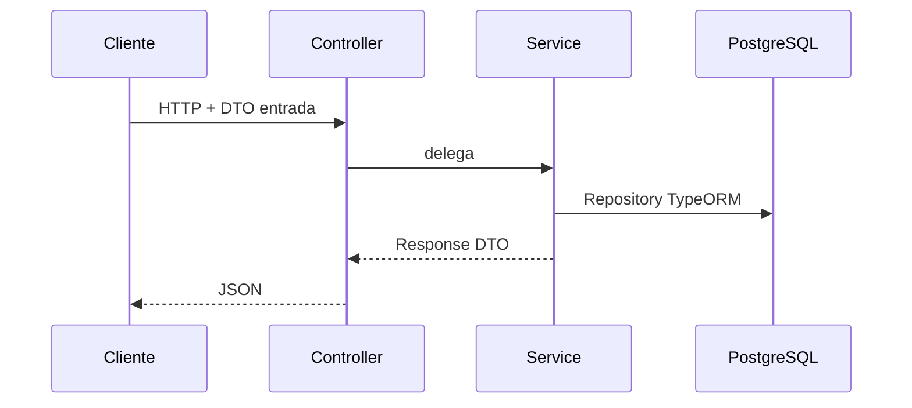

# Arquitectura y estilo de código — ms-business

Documentación extendida (ejemplos route/node/stop): `ms-business/docs/ARCHITECTURE.md`.

## Capas por dominio

Cada feature vive en `src/<dominio>/`:

```
<dominio>/
├── <dominio>.module.ts
├── <dominio>.controller.ts   # HTTP delgado
├── <dominio>.service.ts      # negocio + TypeORM
├── entities/*.entity.ts
└── dto/
    ├── base-*.dto.ts
    ├── create-*.dto.ts
    ├── update-*.dto.ts       # PartialType desde @nestjs/swagger
    ├── response-*.dto.ts
    └── response-*-list.dto.ts
```

## Flujo de una petición



1. **Controller** — `@Get`, `@Post`, `@Body`, `@Query`, `@Param`; decoradores Swagger; guards en rutas sensibles.
2. **Service** — valida FKs, reglas de dominio, paginación, mapeo entidad → response DTO.
3. **Entity** — solo persistencia; **nunca** devolver la entidad cruda en la API.

## Módulos transversales

| Carpeta | Rol |
|---------|-----|
| `src/auth/` | `JwtValidationService`, guards, `@Public()`, `@CurrentUser()`, `@Roles()` |
| `src/shared/` | DTOs paginación, filtros HTTP, `applySwaggerBearerAuth` |
| `src/migrations/` | Cambios de esquema (`synchronize: false`) |

## Convenciones de código

- **Idioma:** comentarios/docs de dominio en español; nombres de clases, métodos y archivos en inglés.
- **Imports:** alias `@/` → `src/` (tsconfig paths).
- **DTOs:** `class-validator` en entrada; `@ApiProperty` en campos expuestos a Swagger.
- **Listas:** `{ items: T[], meta: PaginationMetaDto }`.
- **Auth:** no firmar JWT aquí; `JwtValidationService` → `POST {MS_SECURITY_URL}/api/public/security/validate-token`.
- **Errores:** `HttpExceptionFilter` global en `main.ts`.

## Dominios registrados

Ver [domains-and-modules.md](domains-and-modules.md) para entidades, relaciones y reglas por módulo.

## Crear un endpoint (orden recomendado)

1. Entity (+ migración si cambia esquema).
2. DTOs base → create → update → response (+ list si aplica).
3. Service (reglas + mapeo).
4. Controller + Swagger + guards si es protegido.
5. Registrar módulo en `app.module.ts` si es dominio nuevo.
