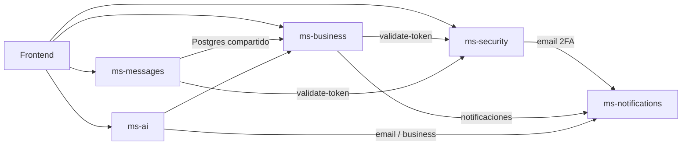

# urbango-api

Backend de **UrbanGo** (transporte público UCaldas). Repositorio: [github.com/Cristian46310/urbango-api](https://github.com/Cristian46310/urbango-api).

Monorepo de microservicios HTTP independientes: autenticación, dominio de transporte, mensajería en tiempo real, notificaciones por correo y automatización con IA. **ms-messages** y **ms-business** comparten PostgreSQL; **ms-security** usa el schema `security` (Supabase/Postgres).

## Microservicios y librerías

| Servicio | Stack principal | Puerto | Carpeta | Rol |
|----------|-----------------|--------|---------|-----|
| **ms-security** | Spring Boot 4, Java 17, Spring Security, JPA, JJWT, SpringDoc, Google API Client | 8080 | `ms-security/` | Auth, JWT, OAuth (Google/GitHub), 2FA, roles y permisos |
| **ms-business** | NestJS 11, TypeORM, PostgreSQL (`pg`), Socket.IO, Swagger, Axios, class-validator | 3000 | `ms-business/` | Rutas, buses, tickets, incidentes, conductores |
| **ms-messages** | NestJS 11, TypeORM, Socket.IO, Swagger, Axios | 3001 | `ms-messages/` | DM, grupos, alertas masivas, WebSocket |
| **ms-notifications** | FastAPI, Gmail API (`google-api-python-client`), OAuth, uv, Ruff | 8000 | `ms-notifications/` | Correos (2FA, incidentes, avisos) |
| **ms-ai** | FastAPI, LangChain / LangGraph, httpx, psycopg2, uvicorn | 8001 | `ms-ai/` | Citas, PQRS, clima, recordatorios de ruta |

## Arquitectura



### Flujo de autenticación

1. El frontend inicia sesión en **ms-security** y recibe un JWT.
2. **ms-business** y **ms-messages** validan el token con `POST /api/public/security/validate-token`.
3. Los IDs de usuario en ms-security son UUID; en ms-business se almacenan en `persons.user_id`.

## Requisitos previos

- **Java 17** y Maven (ms-security)
- **Node.js 22** y **pnpm** (ms-business, ms-messages)
- **Python 3.12+** y **uv** (ms-notifications); Python 3.11+ (ms-ai)
- **PostgreSQL** (Supabase recomendado): schema `security` + schema `public` compartido
- Cuenta Gmail con OAuth2 (ms-notifications) — ver `ms-notifications/README.md`

## Desarrollo local

Orden recomendado al levantar el stack:

0. **Migraciones de BD** — ver [docs/DATABASE.md](docs/DATABASE.md)
1. PostgreSQL / Supabase
2. **ms-notifications** (puerto 8000) — necesario para 2FA y correos
3. **ms-security** (puerto 8080) — sin él no hay validación JWT
4. **ms-business** (puerto 3000)
5. **ms-messages** (puerto 3001) — opcional según la funcionalidad
6. **ms-ai** (puerto 8001) — opcional

### Arrancar todo (Windows)

Desde la raíz del repo, abre **una ventana de PowerShell por microservicio**:

```powershell
.\scripts\start-all.ps1
```

Solo algunos:

```powershell
.\scripts\start-all.ps1 -Only ms-security,ms-business
```

Si un puerto ya está ocupado, ese servicio se omite.

### ms-security

```bash
cd ms-security
cp .env.example .env   # editar DB_URL, JWT_SECRET, etc.
./mvnw spring-boot:run
```

- Swagger: http://localhost:8080/swagger-ui/index.html
- Health: http://localhost:8080/api/health
- Guía detallada: [ms-security/SETUP-LOCAL.md](ms-security/SETUP-LOCAL.md)

### ms-business

```bash
cd ms-business
cp .env.example .env
pnpm install
pnpm run migration:run
pnpm run start:dev
```

- Swagger: http://localhost:3000/docs
- Arquitectura: [ms-business/docs/ARCHITECTURE.md](ms-business/docs/ARCHITECTURE.md)

### ms-messages

```bash
cd ms-messages
cp .env.example .env
pnpm install
pnpm run migration:run
pnpm run start:dev
```

- Swagger: http://localhost:3001/docs
- WebSocket: namespace `/messages`, path `/messages/ws`

### ms-notifications

```bash
cd ms-notifications
cp .env.example .env
mkdir -p secrets   # colocar client_secret_*.json
uv sync
uv run fastapi dev --host 0.0.0.0 --port 8000
```

- Docs: http://localhost:8000/docs

### ms-ai

```bash
cd ms-ai
uv sync
cp .env.example .env   # si existe
node scripts/migrate.cjs
uvicorn main:app --reload --port 8001
```

- Docs: http://127.0.0.1:8001/docs

## Migraciones de base de datos

**Comando único** (desde la raíz, primera vez o tras pull con migraciones nuevas):

```bash
cd ms-business && pnpm install && cp .env.example .env   # editar DB_URL
cd ..
node scripts/db-migrate.cjs
```

Aplica en orden: ms-security → ms-business → ms-messages → ms-ai.

Por servicio: `pnpm run migration:run` en NestJS; `node scripts/sql-migrate.cjs ms-security|ms-ai` para SQL.

Guía completa: [docs/DATABASE.md](docs/DATABASE.md).

## Verificación rápida

```bash
cd ms-security && ./mvnw clean package -DskipTests
cd ms-business && pnpm run lint && pnpm run build
cd ms-messages && pnpm run verify
cd ms-notifications && uv run ruff check . && uv run ruff format --check .
```

Health checks:

```bash
curl -s http://localhost:8080/api/health
curl -s http://localhost:8000/api/email/health
curl -s http://localhost:3001/health
```

## Documentación

| Tema | Ubicación |
|------|-----------|
| Base de datos y migraciones | [docs/DATABASE.md](docs/DATABASE.md) |
| Roles y autorización | [docs/ROLES.md](docs/ROLES.md) |
| Login GitHub (frontend) | [docs/GITHUB_LOGIN_FRONTEND.md](docs/GITHUB_LOGIN_FRONTEND.md) |
| Despliegue | [docs/DEPLOY.md](docs/DEPLOY.md) |
| Arquitectura ms-business | [ms-business/docs/ARCHITECTURE.md](ms-business/docs/ARCHITECTURE.md) |

Cada microservicio tiene su propio `README.md` con variables de entorno y endpoints.

## CI

GitHub Actions ejecuta build, lint y tests por microservicio (`.github/workflows/`).

## Mejoras futuras

Roadmap planificado (no implementado aún):

- **Contenedorización**: `docker-compose.yml` y Dockerfiles por servicio para despliegue reproducible.
- **ms-business en compose**: integrar el servicio NestJS al stack containerizado.
- **Despliegue en producción**: guía de despliegue sin Docker (VPS/cloud) y pipeline CI/CD completo.
- **Escalado de WebSocket**: soporte multi-instancia en ms-messages (Redis adapter o similar).
- **Observabilidad**: métricas centralizadas, tracing distribuido y alertas operativas.
- **ms-ai**: integración más profunda con ms-business (rutas en vivo, PQRS automatizado).
- **Tests e2e cross-service**: flujos completos login → abordaje → mensajería en CI.

## Licencia

Ver [LICENSE](LICENSE).
