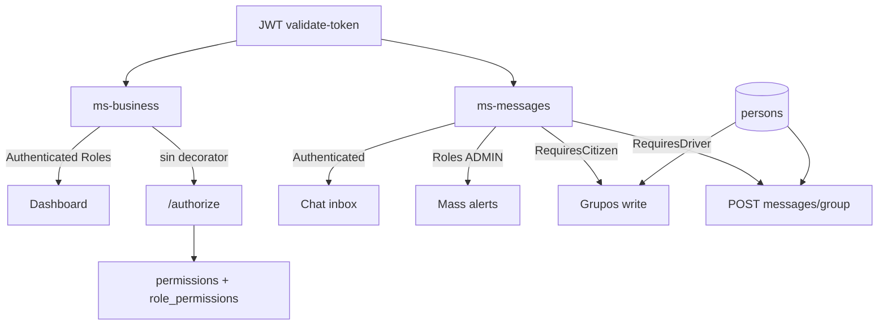

# Roles y autorización (UCaldas)

Documento vivo alineado con **ms-security** (PostgreSQL schema `security`), **ms-business** (`:3000`) y **ms-messages** (`:3001`).

## Capas de acceso

No todo pasa por la tabla `security.permissions`:

| Capa | Dónde | Qué valida |
|------|--------|------------|
| JWT + `@Authenticated()` | business + messages | Token válido vía `POST /api/public/security/validate-token`. **No** consulta permisos. |
| JWT + `@Roles(...)` | business dashboard; messages mass-alerts | Nombres en claim `roles` del JWT (`ADMIN`, `CITIZEN`, …). |
| `/authorize` + `permissions` | Rutas de ms-business **sin** `@Authenticated` / `@Public` | `POST /api/public/security/authorize` con `{ method, url }`. |
| Perfil dominio (`persons`) | ms-messages | `type=citizen` / `type=driver`. **No** es el rol JWT. |
| Membresía local | ms-messages grupos | `group_members.role = admin` (solo en esa BD). |



### Distinción crítica

| JWT (ms-security) | Perfil negocio (`persons`) |
|-------------------|----------------------------|
| Rol `CITIZEN` | Fila con `type=citizen` (tras `POST /citizen`) |
| Rol `DRIVER` | Fila con `type=driver` (tras `POST /driver`) |

El rol se asigna al **crear el usuario** (`CITIZEN` por defecto) o al promover. El perfil se crea en ms-business. En ms-messages:

- Chat DM / inbox: basta JWT.
- Crear / unirse a grupos: hace falta **perfil** citizen.
- Enviar a grupos: hace falta **perfil** driver.
- Mass-alerts: hace falta rol JWT **`ADMIN`**.

Flujo coherente: register → rol `CITIZEN` → `POST /citizen` → grupos en messages. Promote → rol `DRIVER` (sin quitar `CITIZEN`) + `POST /driver` → mensajes a grupos.

## Roles JWT

| Rol | Quién | ms-business | ms-messages |
|-----|--------|-------------|-------------|
| **CITIZEN** | Pasajero (default al registrarse) | Lectura catálogo vía authorize; realtime dashboard (`@Roles`); abordaje/tickets `@Authenticated` | Chat OK; write grupos solo con perfil citizen |
| **DRIVER** | Conductor (mantener también `CITIZEN`) | `POST /incident-reports/driver` + lectura; turn `@Authenticated` | `POST /messages/group` solo con perfil driver |
| **SUPERVISOR** | Ops | Dashboard + incidentes (authorize / `@Roles`) | Chat autenticado; **no** mass-alerts |
| **BUSINESS_ADMIN** | Admin empresa | Flota + ops incidentes | Chat; **no** mass-alerts (salvo que también tenga `ADMIN`) |
| **ADMIN** | Plataforma | Todo business + admin RBAC en ms-security | Mass-alerts (`@Roles('ADMIN')`) + chat |
| **USER** | Legado | Sin permisos de negocio sembrados | No usar en usuarios nuevos |

## Matriz sembrada (`V2__seed_permissions.sql`)

Paths Nest de ms-business (sin prefijo `/api`). Patrones `/*` como en `PermissionService`.

### CITIZEN

- `GET /route`, `GET /route/*`
- `GET /stop`, `GET /stop/*`
- `GET /bus`, `GET /bus/*`
- `GET /scheduler`, `GET /scheduler/*`
- `GET /node`, `GET /node/*`
- `GET /history`, `GET /history/*`

No en seed (ya `@Authenticated` / `@Roles`): boarding, tickets, card-recharge, `/citizen/me`, dashboard realtime.

### DRIVER

Asume multi-rol **CITIZEN + DRIVER**. Extra:

- `POST /incident-reports/driver`
- `POST /gps/bus/*`
- `GET /gps`, `GET /gps/*`

### SUPERVISOR

Lectura catálogo (= CITIZEN) +

- `GET /incident-reports`, `GET /incident-reports/*`
- `PUT /incident-reports/*/status`
- `GET /incident-reports/*/comments`, `POST /incident-reports/*/comments`
- GPS lectura/escritura ops: mismos GPS que DRIVER + `PUT|DELETE /gps/*`

Dashboard: **no** en seed (`@Roles` en código).

### BUSINESS_ADMIN

Todo SUPERVISOR + flota:

- `POST /bus`
- `GET /bus/fleet` (cubierto también por `GET /bus/*`)
- `PUT /bus/*`, `DELETE /bus/*`
- `POST /bus/*/photo`
- `POST /bus-photo/bus/*`, `GET /bus-photo/*`, `DELETE /bus-photo/*`

Mutaciones de red (route/stop/scheduler/node) y enterprise: **solo ADMIN**.

### ADMIN

Unión de CITIZEN + DRIVER + SUPERVISOR + BUSINESS_ADMIN +

- `POST|PUT|DELETE /route`, `/route/*`
- `POST|PUT|DELETE /stop`, `/stop/*`
- `POST|PUT|DELETE /scheduler`, `/scheduler/*`
- `POST|PUT|DELETE /node`, `/node/*`
- `POST /node/route/*/stop/*` (creación de nodos)
- `POST|PUT|DELETE /enterprise`, `/enterprise/*`
- `POST|PUT|DELETE /history`, `/history/*`
- Admin ms-security (interceptor, URLs tras quitar `/api`):  
  `GET|POST /roles`, `GET|PUT|DELETE /roles/?`,  
  `GET|POST /permissions`, `GET|PUT|DELETE /permissions/?`,  
  `POST /role-permission/assign-multiple`, `POST /role-permission/role/?/permission/?`, `DELETE /role-permission/?`

### USER

Sin filas en `role_permissions`.

### ms-messages (solo documentación; no SQL)

| Capacidad | Mecanismo |
|-----------|-----------|
| DM, inbox, leer grupos, alertas personales | JWT |
| Crear / unirse / icon grupos | Perfil `persons` citizen |
| `POST /messages/group` | Perfil `persons` driver |
| `/mass-alerts/*` | Rol JWT `ADMIN` |
| Admin de un grupo | `group_members.role = admin` |

## Aplicar seed

Desde `ms-business/` (usa `DB_URL` del `.env`):

```bash
node ../ms-security/db/apply-v1.cjs   # schema + roles (si aún no)
node ../ms-security/db/apply-v2.cjs   # permissions + role_permissions
```

Promover un usuario a ADMIN (después de existir en `security.users`):

```sql
INSERT INTO security.user_roles (id, user_id, role_id)
SELECT uuid_generate_v4(), u.id, r.id
FROM security.users u
CROSS JOIN security.roles r
WHERE u.email = 'admin@ejemplo.com' AND r.name = 'ADMIN'
ON CONFLICT (user_id, role_id) DO NOTHING;
```

## Checklist smoke

### ms-business

| Caso | Esperado |
|------|----------|
| JWT solo `CITIZEN` → `GET /route` | 200 |
| JWT solo `CITIZEN` → `POST /bus` | 403 |
| `CITIZEN`+`DRIVER` + perfil/turno → `POST /incident-reports/driver` | 200 (o error de negocio, no 403 RBAC) |
| `BUSINESS_ADMIN` → `POST /bus` / `GET /bus/fleet` | 200 |
| `ADMIN` → `POST /route` | 200 |
| Dashboard supervisor con rol en `@Roles` | 200 **sin** depender del seed V2 |

### ms-messages

| Caso | Esperado |
|------|----------|
| JWT sin perfil citizen → chat DM | 200 |
| JWT sin perfil citizen → `POST /groups` | 403 |
| Perfil citizen → crear/unirse grupos | 200 |
| Perfil driver → `POST /messages/group` | 200 |
| Rol JWT `ADMIN` → `/mass-alerts` | 200 |
| Solo `BUSINESS_ADMIN` → `/mass-alerts` | 403 |

## Modelos en `security` (resumen)

- **User**: identidad (UUID, email, password BCrypt).
- **Role**: `ADMIN`, `USER`, `CITIZEN`, `DRIVER`, `BUSINESS_ADMIN`, `SUPERVISOR`.
- **Permission**: `(url, method)` único.
- **UserRole** / **RolePermission**: N:M.

Login / register son públicos (`/api/public/**`): **no** requieren rol. Tras crear usuario se asigna `CITIZEN`.

## Autenticación entre microservicios (Internal Key)

Rutas sensibles de directorio/roles **ya no** están en `/api/public`.

| Consumidor | Endpoint | Header |
|------------|----------|--------|
| ms-business | `POST /api/internal/user-role/user/{id}/role-name/{ROLE}` | `X-Internal-Key` |
| ms-messages | `GET /api/internal/users` · `GET /api/internal/users/{id}` | `X-Internal-Key` |
| Admin humano | ` /api/users`, `/api/user-role` | JWT Bearer + permisos ADMIN |

Configura el **mismo** valor en ms-security, ms-business y ms-messages:

```env
MS_SECURITY_INTERNAL_KEY=<secreto_largo_aleatorio>
```

Sin el header (o con key incorrecta) → **401**. Sin key configurada en security → **503** en `/api/internal/**`.

Admin CRUD: `/api/users`, `/api/user-role` requieren JWT; Spring Security exige autenticación y el interceptor RBAC exige permisos (seed V4).

## Passwords (BCrypt)

Hash con BCrypt (`PasswordEncoder`). Cuentas OAuth pueden tener `password` NULL; login email/password responde error claro si no hay password local.

## JWT y roles frescos

- El JWT guarda un snapshot de roles al emitirse.
- `POST /api/public/security/validate-token` **releé** roles desde BD (lo usan ms-business / ms-messages).
- `POST /api/public/security/refresh-token` (Bearer válido) emite un **nuevo** JWT con roles actuales (útil tras promover a DRIVER/ADMIN).
- La UI no debe confiar solo en claims viejos del access token para gates críticos.

## Perfil de dominio (no en ms-security)

`security.profiles` (phone/photo) fue eliminado. El perfil de persona vive en **ms-business**:

- Ciudadano: `POST /citizen`, `GET /citizen/me`
- Conductor: `POST /driver` (requiere rol JWT `DRIVER`), `GET /driver/me`

`GET /api/public/security/me` solo devuelve identidad auth: `id`, `name`, `email`, `roles`, `permissions` (sin `profile`).
